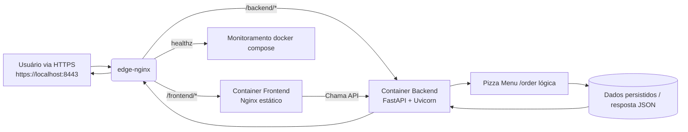

# project_root_devs2blu_004

Stack principal do programa Devs2Blu integrando `app/`, `core/` e a pasta `containers/` (compose com backend FastAPI, frontend estático e proxy Nginx). O fluxo abaixo em Mermaid ilustra como um pedido HTTPS percorre os serviços:

Clone o repositório, execute `git submodule update --init --recursive` e suba os containers com `sudo env EDGE_HTTP_PORT=8080 EDGE_HTTPS_PORT=8443 docker compose -f containers/docker-compose.yml up --build -d`.

Add teste abcd 20:20